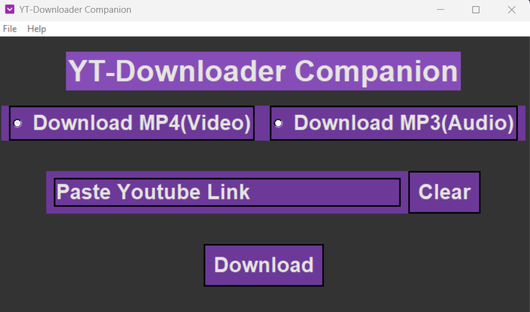

# Python Youtube downloader(MP3/MP4) GUI

A simple youtube downloader made using python, made using pytubefix and tkinter libraries.

## License

[MIT](https://choosealicense.com/licenses/mit/)

## Features

- simple interface
- customizable and auto output path
- MP3/MP4 download

## Installation

You may install requirements
with pip install requirements.txt.
To start to project simply execute main.py

    
## Screenshots

## Roadmap

- Additional list support to download multiple videos at once

- thumbnail preview

